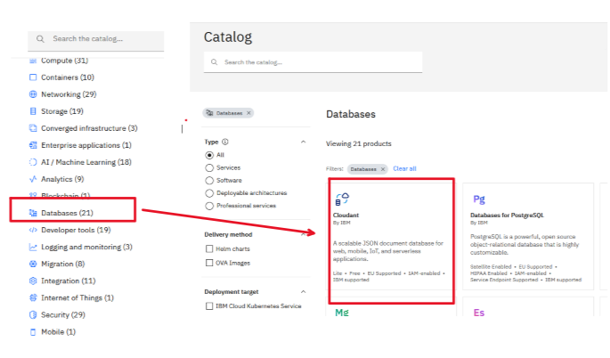
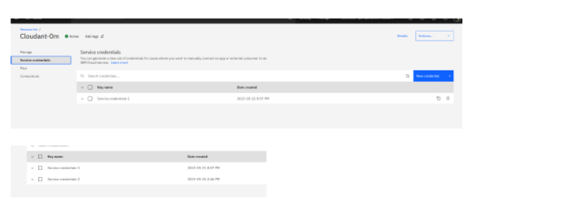
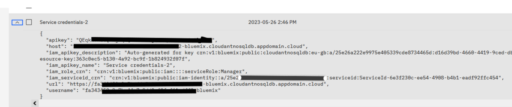

# cenodebesrvc  Node.js BackEnd Rest APi integrated with  IBM Cloudant for IBM Code Engine

## Ціль
Додаток розроблений як прототип для вивчення роботи з IBM CodeEngine. Взаємодіє з хмарною NoSQL базою даних IBM Cloudant. Додаток являє собою Rest API, що моделює щось на зразок електронного магазину. Додаток використовується для його deployment в IBM Code Engine і подальшого тестування.

## Створення БД Cloudant в IBM Cloud

Для зпуску додатку в IBM Cloud потрібно розгорнути базу даних IBM Cloudant та створити Credantials  для доступу з локального ноутбука до хмарної бази даних. Знайти Cloudant в  хмарному каталозі можна за прямим лінком: [Cloudant](https://cloud.ibm.com/catalog/services/cloudant) або в каталозі [pic-01](#pic-01). 

<kbd></kbd>
<p style="text-align: center;"><a name="pic-01">pic-01</a></p>

Після створення сервісу БД  потрібно стоврити credentials,  як показано на [pic-02](#pic-02)

<kbd></kbd>
<p style="text-align: center;"><a name="pic-02">pic-02</a></p>


А для доступу з локального компа нас цікавить JSON,  що відкривається в credentials [pic-03](#pic-03)

<kbd></kbd>
<p style="text-align: center;"><a name="pic-03">pic-03</a></p>

В цьому JSON  нас будуть цікавити ключі: **apikey**,та **url**.


## Запуск локально

- Для запуску локально потрібно склонувати репзиторій на робочу станцію:

```bash
    git clone https://github.com/pavlo-shcherbukha/cenodebesrvc.git -b main
``` 

- встановити залежності

```bash
    npm install
```

- Підготувати конфігураційний файл **/server/localdev-config.json**, який моделює env-змінні:

```json
 {
  "CLOUDANT_URL": "https://****************-bluemix.cloudantnosqldb.appdomain.cloud",
  "CLOUDANT_APIKEY": "***********-kuN81N",
  "STORAGE_DBNAME": "storagedb"

 }

```
Признаення ключів json:
- CLOUDANT_URL  вноситься ключ "url" з credentials;
- CLOUDANT_APIKEY вноситься ключ "apikey" з credentials;
- STORAGE_DBNAME  назва бази даних.


- Вказати номер локальнго порта в файлі: **server/config/local.json**. Там встановлено port=8080.


- Запустити додаток кмандою

```bash
   npm start
```

Додаток доступний по url: http://localhost:8080/

## Запуск під управлінням CodeEngine

Запуск під управлінм CodeEngine  описано в [ibm cloud Code Engine](https://pavlo-shcherbukha.github.io/posts/2023-05-11/ibmcloud-codeengine/).  Відповідно ключі , що згадані в файлі  **/server/localdev-config.json** повинні бути перенесені як env - змінні в CodeEngine.
В корені репозиторію знаходиться Dockerfile для побудови контейнера в CodeEngine.


## Опис розробленого API

APi взаємодіє з БД Cloudant. Апі БД Cloudant доступно по лінку:  [ Cloudsant Client libraries](https://cloud.ibm.com/docs/Cloudant?topic=Cloudant-client-libraries#client-libraries).

### Зареєструвати продукт  http-post /api/productregistry

- Method HTTP-POST
- Request
    - HTTP-Headers
        ```text
            Content-type: application/json
        ```
    - request body
        ```json
            {
                "product_id": "Laptop2",
                "product_title": "Laptop ASUS-A21"
            }
        ```
- Response
    - Status Code = 200
    - Response body     

    ```json
        {
        "status": 201,
        "statusText": "Created",
        "headers": {
            "cache-control": "must-revalidate",
            "content-type": "application/json",
            "date": "Fri, 26 May 2023 14:55:54 GMT",
            "location": "https://fa343450-0e7b-44a7-9dd0-f9fcf61edff2-bluemix.cloudantnosqldb.appdomain.cloud/storagedb/Laptop3",
            "transaction-id": "fda66028bae3a26bc4a0915353dff819",
            "x-cloudant-action": "cloudantnosqldb.data-document.write",
            "x-couch-request-id": "fda66028ba",
            "x-frame-options": "DENY",
            "server": "Cloudant",
            "strict-transport-security": "max-age=31536000",
            "x-content-type-options": "nosniff",
            "x-cloudant-request-class": "write",
            "x-cloudant-backend": "bm-cc-eu-gb-08",
            "via": "1.1 lb2.bm-cc-eu-gb-08 (Glum)",
            "transfer-encoding": "chunked",
            "vary": "Accept-Encoding"
        },
        "result": {
            "ok": true,
            "id": "Laptop3",
            "rev": "1-05d4b59a36ae0c66d323ae53b48ea4df"
        }
        }
    ```

### Прочитати список продуктів  http-get /api/productregistry

- Method HTTP-GET
- Request
    - HTTP-Headers
        ```text
            Content-type: application/json
        ```
- Response
    - Status Code = 200
    - Response body     

    ```json
        {
        "list": [{
            "product_id": "Laptop1",
            "product_title": "Laptop tnonkpad"
        }, {
            "product_id": "TeaCup",
            "product_title": "Tea cup with picure"
        }, {
            "product_id": "Laptop2",
            "product_title": "Laptop2 tnonkpad"
        }, {
            "product_id": "Laptop3",
            "product_title": "Laptop ASUS-A21"
        }]
        }
    ```

### Прочитати список продуктів  http-option /api/productregistry
- Response
    - Status Code = 200

### Прочитати опис продукту  http-get /api/productregistry/:prod_id


- Method HTTP-GET
- Request
    - HTTP-Headers
        ```text
            Content-type: application/json
        ```
- Response
    - Status Code = 200
    - Response body     

    ```json
            {
            "product": "Laptop3",
            "settings": {
                "_id": "Laptop3",
                "_rev": "1-05d4b59a36ae0c66d323ae53b48ea4df",
                "title": "Шаблон продукта",
                "producer": {
                "name": "",
                "country": "",
                "adress": "",
                "email": ""
                },
                "product": {
                "serial": "",
                "name": "",
                "cost": 0,
                "amount": 0
                }
            }
            }
    ```
### Оновити опис продукту  http-post /api/productregistry/:prod_id

- Method HTTP-POST
- Request
    - HTTP-Headers
        ```text
            Content-type: application/json
        ```
    - request body
        ```json
            {
                    "product": "Laptop3",
                    "settings": {
                        "_id": "Laptop3",
                        "_rev": "1-05d4b59a36ae0c66d323ae53b48ea4df",
                        "title": "Шаблон продукта",
                        "producer": {
                        "name": "",
                        "country": "",
                        "adress": "",
                        "email": ""
                        },
                        "product": {
                        "serial": "",
                        "name": "",
                        "cost": 0,
                        "amount": 0
                        }
                    }
                }
        ```
- Response
    - Status Code = 200
    - Response body     

    ```json
            {
            "status": 201,
            "statusText": "Created",
            "headers": {
                "cache-control": "must-revalidate",
                "content-type": "application/json",
                "date": "Fri, 26 May 2023 15:28:33 GMT",
                "location": "https://fa343450-0e7b-44a7-9dd0-f9fcf61edff2-bluemix.cloudantnosqldb.appdomain.cloud/storagedb/Laptop3",
                "transaction-id": "7ffad7ca458cc808daaa979d73f94b7d",
                "x-cloudant-action": "cloudantnosqldb.data-document.write",
                "x-couch-request-id": "7ffad7ca45",
                "x-frame-options": "DENY",
                "server": "Cloudant",
                "strict-transport-security": "max-age=31536000",
                "x-content-type-options": "nosniff",
                "x-cloudant-request-class": "write",
                "x-cloudant-backend": "bm-cc-eu-gb-08",
                "via": "1.1 lb2.bm-cc-eu-gb-08 (Glum)",
                "transfer-encoding": "chunked",
                "vary": "Accept-Encoding"
            },
            "result": {
                "ok": true,
                "id": "Laptop3",
                "rev": "2-a563765d3451ce9c08196ed9e36b1194"
            }
            }
    ```

### опис продукту  http-option /api/productregistry/:prod_id    
- Response
    - Status Code = 200